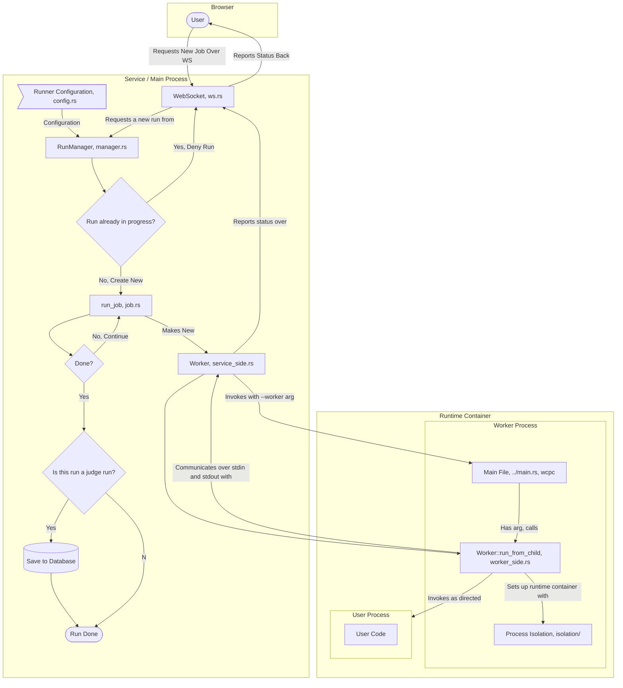

# Runner Documentation

This document outlines the architecture of the `run` module of WCPC.

This is a fairly complex module as it is required to do many things,
(connect to a websocket, isolate a process in a container,
run and keep track of test cases while judging etc.).

This will serve as a general guide to the flow of the module from top to bottom, starting from a user
connecting via a WebSocket all the way down to the actual Runner struct that runs user code.

## Overall Diagram



Control flow starts with `User` in the browser, ends with `Run Done`

Note that although "Service Process" is monolithic here, all calls inside of it are non-blocking and async.
The rest of the site still functions while a run is in progress.

Also of note is that while although depicted as inside `Runtime Container`, the Worker Process *starts* outside of
it. It will only move inside of it after the container is setup by `isolation/`. *Technically* we should depict
this as two separate processes as the worker process performs a fork while isolating that starts a new version
of itself inside the container, and exits in the parent. However, the diagram is simplified for clarity and visuals.
More details on exactly how isolation occurs can be found in the following sections.

This chart provides a general overflow of control flow and communication, see the following sections for more details
on the inner workings of each component.

## Service Process

"Service process" refers to the website's process, which performs everything in on the backend.
During initialization the backend will load the runner configuration from the `Rocket.toml` using the types
in `config.rs`. This config is passed to the `new` function of `RunManager` which will save it to be sent to worker processes.

## Run Manager (manager.rs)

The run manager will keep track of all runs on the site, each user is allowed to have a single run in progress at a time.
Due to this the manager simply keeps a HashMap of user ids to active run handles.

Any requests to start a new run will go through the manager, which will do validity checks on the user's request
such as making sure the language the user chose is valid, ensuring they don't have a run in progress, etc.

The run manager allows subscribing to various events that consumers will need to keep track of:

1. Global Shutdown, all consumers should subscribe to this oneshot to perform cleanup in the event the web server is shut down (i.e. disconnecting a websocket)
2. Job Started, for a specific user a consumer can subscribe to this to be notified when a new job is started, this will let the consumer notify the user that a job has started. The manager sends the problem id to the user so they can make sure to only show status if the current problem matches
3. Problem Update, due to some internal behaviour all consumers *must* shutdown in the event the problem they're linked to is updated, this is to ensure the manager only uses the most up-to-date problem data.
4. Job State updates, the main event that consumers will be interested in, this will notify the consumer of any changes in the state of the job, users need to provide a user id and problem id to subscribe to this event.

The `RunManager` also handles pre-compiling `BPF` filters for `seccomp` in the runtime container during initialization, this allows for any errors in the user's configuration to be caught before the server even starts, and also saves on time later.

### Requesting Jobs

The run manager takes a request for a job via the `JobRequest` struct, components of this will needed to be gotten via
helper functions on the manager itself, such as getting the language config to use. Currently this is a bit cumbersome to manually construct a JobRequest, in the future the manager may instead take a struct that's a subset of `JobRequest` and automatically fill in the rest.

Upon a job request the manager will check if the user has a job in progress, if they do it will deny the request.
This is mostly to keep the server from being overloaded and to deter abuse.

If the user does not have a job in progress, the manager emits a new job event, and sets up a channel to send
job state over, consumers may subscribe to this channel to receive updates on the job. Note that consumers will not directly
get back the RX for the channel, but instead will have to listen on the job started event and then request the handle manually.

Once all setup is complete the manager will spawn a new async task to handle the job, this task
will create a new `Worker` struct that will handle actually running everything.

### After Job Run

After `Worker::spawn` returns within the async task, the manager will then check if the run was a judge run and save the results to the database if it was.

## WebSocket (ws.rs)

The websocket module handles communication with the user's browser over a websocket connection. The UI of the problem
page is set to listen for updates on the job state, and will update the user's view based on the state of the job.

The logic for handling all the state updates is a bit complex, but the general idea is as simple as that.

## Job (job.rs)

`run_job` is a function that will handle running a job, it will first create a new `Worker` struct and then compile and run the user's code on each test case. It send back state updates
via a channel to consumers, and will stop running test cases if one fails.

## Worker (worker/)

The worker folder is a bit special because it runs in two different contexts, the first is the service process (`service_side.rs`) and the second is the worker process (`worker_side.rs`).

The `mod.rs` file contains common types between the two.

### Inside the Service Process

The `Worker` struct is instantiated inside of the service process, it's passed all the info it needs from the job running it and handles creating and communicating with the worker process.

We communicate with the worker process over stdin and stdout, sending it the job to run and receiving back the results. The format is simply JSON messages, with each message being a single line.

For `stderr`, the service process simply forwards this to the actual `stderr` of the program, this is to allow for easier logging from within the worker process.

It should technically be noted that this struct actually tracks *two* processes due to implementation details for process isolation we'll get into later.

### Invoking a new Worker

To actually start a new worker process we execute our own binary again, but with the `--worker` flag set. `main.rs` has special behavior for this flag and will call `worker::worker_side::run_from_child` instead of the normal `main` function,
which would start Rocket and the entire web server.

The advantage of this over a completely separate binary is simplicity, we can share the same codebase without having to worry about creating a monorepo to manager two separate binaries and a shared library between them.

### Inside the Worker Process

Okay so we've been invoked with `--worker`, now we ran the `run_from_child` function. This function will first read initial information it needs to setup the worker process from stdin.

Then we'll go through isolating our process, which will be the next section.

After isolation we send `WorkerMessage::Ready` to signify that we're ready for
commands from the service process. We simply run any `WorkerMessage::RunCmd` commands
we receive, and break out of this loop upon receiving `WorkerMessage::Stop`.

In the event that we fail in the last two steps, instead of simply exiting we'll send `WorkerMessage::InternalError` back to the service process, this is to allow the service process to gracefully handle the error instead of relying on waiting
for the worker process to exit and then checking the exit code.

## Process Isolation

> [warning] WIP
> Currently the process isolation is not fully implemented, we're still
> working on getting everything setup so this section will update in the future.

This is the most complex part of this entire module, and is the most important part of the entire system. We're running **completely un-trustable** user code, and we must ensure
that it can't do anything malicious. Many of the complexities of the rest of the run
system are due to this isolation.

We utilize various security features of the Linux kernel to achieve this, we make many specific syscalls to setup the container and therefore this will only work on Linux. Specifically we also only support seccomp filtering on x86_64 and aaarch64 as of now.

### General Isolation Overview

1. `unshare` to create various new namespaces for our process
   1. New user namespace
   2. New mount namespace
   3. New PID namespace*
   4. New network namespace
   5. New UTS namespace
   6. New IPC namespace
   7. New Cgroup namespace
2. *We don't get put in this namespace, so we need to perform some magic to get inside of it
3. Map UIDs and GIDs to the host system, specifically `0` and `1` are mapped, `1`
4. Setup a new environment for us to work in
   1. Create a new temp folder
   2. Mount a new `tmpfs` filesystem to the temp folder
   3. Create various needed directories and mounts in the temp folder
   4. Set proper permissions
5. Chroot into our new temp folder, making sure to also chdir
6. Setup the user part of the container
   1. Make a home directory for the user
   2. Give the user ownership of the home directory
   3. Set `keepcaps` to 0 to ensure we lose all capabilities when we setuid
   4. Set uid and gid to the user
7. Harden our process a bit more
   1. Set the `no_new_privs` and `dumpable` flags
   2. Setup a `seccomp` filter for syscalls
8. Use cgroups to apply resource limits

### Unshare

First we perform an `unshare` to create new namespaces for our process. This is to ensure that our process is completely

- `CLONE_NEWUSER` to create a new user namespace, meaning we have root in our namespace but not on the host system
- `CLONE_NEWNS` to create a new mount namespace, meaning all of our mounts are isolated from the host system
- `CLONE_NEWPID` to create a new PID namespace, meaning we hide all outside processes from our process
- `CLONE_NEWNET` to create a new network namespace, meaning no network access
- `CLONE_NEWUTS` to create a new UTS namespace, meaning we can't change the hostname
- `CLONE_NEWIPC` to create a new IPC namespace, meaning we can't communicate with other outside processes
- `CLONE_NEWCGROUP` to create a new cgroup namespace, meaning we can't see or interact with outside cgroups

### The switch-a-roo

We have a problem, we're not actually in the PID namespace we just created. This is because the PID namespace applies
to any child processes we create, but we're still in the parent process namespace. To fix this we need to perform a
`fork`, and continue from the `child` branch of the fork. This will put us in the PID namespace.

To perform this switch our service process needs to be able to know when we fork, otherwise it'll only keep track of
the parent process and not the child. To do this we send a message (`WorkerMessage::RequestUidGidMap`) back to the service process over stdout telling it that we've forked, and giving it the child's new PID. The name of this message is more related
to the next step but we combine the two for simplicity.

The service process then knows it should now wait for the child process to exit, and not the parent.
The parent exits immediately after forking, and the child continues on.

### UID / GID Mapping

I'm going to say uid here, but it applies to both uid and gid. I'll mention when something is specific to one or the other.

Now we need to setup uid mappings in the new user namespace, otherwise we'll be stuck as the "nobody" user, and won't be able
to switch. We want to have multiple users in our container so we can have different permissions for different files within.

To handle this we must tell the Linux kernel how to map our uid to the host system's uid. We do this by writing to
`/proc/self/uid_map` and `/proc/self/gid_map`. We write ranges to these files, for example `0 0 1` would map the uid `0`
in our namespace to the uid `0` on the host system, and `1 1 1` would map the uid `1` in our namespace to the uid `1` on the host system.

Problem: while we *do* have root and many capabilities in our new namespace, we must have had
`CAP_SETUID` permissions within our parent user namespace to setup a uid mapping the way we want. If a process
is within the same user namespace as the process it's trying to set a uid mapping for (in this case the process is ourselves), and it didn't have `CAP_SETUID` in the parent namespace, it can't set a uid mapping.

To get around this we use a command built into most Linux systems called `newuidmap` and `newgidmap`. These commands have
their capabilities set to allow setting UID, which means they can properly write to `/proc/self/uid_map` and `/proc/self/gid_map`
with no restrictions. The way they make this secure is by reading `/etc/subuid` and `/etc/subgid` to determine what ranges
a given user is allowed to map to. So we want to also read that file and pick two random ids in the range to map to.

We also have to call this in the service process, so we make the service process run these commands after receiving `WorkerMessage::ChildPid` sent above. Then we want to ensure our child waits to execute until the service process has finished setting up the mappings by waiting on a message from the service process.

Once mapping is we complete we need to do one last thing. We started this process as
whatever user started the service process (which won't be mapped in our user namespace and will therefore
be represented as the nobody user). So we need to setuid and setgid back to root (`0`) to make sure our
next actions will be done under the correct user.

We now have two user's within our container, `0` and `1000`, and we can switch between them.
We'll get to setting up uid `1000` later, for now we'll stay as root to setup our environment

### Environment Setup

Now we're going to setup a new environment for our process to run in. We're do as much of this as possible as
root to make sure the owner of everything is root, and then we'll switch to the user we want to run as limiting what
they can do.

First and foremost we need to bind mount a new `tmpfs` filesystem to a temporary folder, this is where we'll be doing
all of our work. The service process handles creating the folder for us and sets our CWD to it, so all we have
to do is mount the `tmpfs` filesystem to it. Because we're in a new mount namespace this won't affect the host system
and to it it'll look like an empty directory. We also want to set the permissions on this folder to `755` to ensure only root
may write to it.

Now we need to bind mount any paths out language needs to run. This is different per-system and is configured in Rocket.toml.
We bind mount these with these flags:

- `MS_NODEV` to prevent device files from being created / accessed
- `MS_NOSUID` to prevent setuid binaries from being run (like newuidmap or sudo)
- `MS_NOEXEC` depends on the configuration, but we can prevent execution of files in the mount if needed
- `MS_RDONLY` to prevent writes to the mount
- `MS_PRIVATE` to ensure that mounts are private to our namespace

We'll also auto mount `/dev/null` and `/dev/zero`, `/dev/random`, and `/dev/urandom` to our host system's equivalents, these will
have the same flags as above, including `MS_NOEXEC` to prevent execution of these files.

We also need to setup `/proc`, we mount the special `procfs` here, with `NOEXEC`, `NOSUID`, and `NODEV` flags set. Something
of note is it appears like `procfs` is always mounted as the nobody user, regardless of what user mounts it.

Then we setup some symlinks of `/dev/fd`, `/dev/stdin`, `/dev/stdout`, and `/dev/stderr` to `/proc/self/fd`, `/proc/self/fd/0`, `/proc/self/fd/1`, and `/proc/self/fd/2` respectively. This is to allow the user to access their stdin, stdout, and stderr. As well
as any other file descriptors they may have open. Notably Haskell needs this.

Finally we create `/tmp` and `/dev/shm` which are both meant to be temp directories. We set the perms of this to
`1777` to allow anyone to write to it, but only the owner to delete files.

### Chroot

Now we're ready to enter our container, we chroot into our temp folder and chdir to it. We chrdir to the temp folder
first just to make sure we're in the right place, and then we chroot to it. This will make it so that the root of our
filesystem is now the temp folder, and we can't access anything outside of it. We also chdir to `/` to make sure `PWD`
is set correctly.

### User Setup

Now we setup the user part of the container, we want to switch to the user we're going to run as to limit what they can do.

First we create `/home/runner`, this is where the user's home directory will be. We then give the user ownership of this
directory. Here is where the user's will be placed and (optionally) compiled in.

Then we need to actually switch to the new user, first we set `keepcaps` to 0 to ensure we lose all capabilities when we setuid.
Now we need to first set our gid to `1`, set extra groups to `[1]`, and then our uid to `1`. This must be done in this order, as setting the uid first drops our `CAP_SETGID` capability, and we need that to set our gid.

### Process Hardening

We're almost done, now we just need a little bit of hardening to further prevent tampering.

First we set the `no_new_privs` flag, this will prevent us from gaining any new privileges. This cannot be undone
and ensure that we can never gain new capabilities or privileges (like setuid) when executing a new program. This is good
as it completely prevents `setuid` binaries from being run (`MSFLAGS_NOSUID` helps too).

Then we set the `dumpable` flag to 0, this will prevent us from core dumping, making sure that no sensitive information
can be gotten from sending a signal to our process.

> [warning] Configuration may change in the future to allow filtering by arguments to the syscall as well

Finally we setup a `seccomp` filter to limit the syscalls we can make. This is the most finnicky part of the entire process,
and can be a bit of a pain to setup. `seccomp` is a mechanism to limit the syscalls a process can make. WCPC keeps a list of allowed syscalls in `seccomp.rs`, and combines that with the user configured ones in `Rocket.toml`. By default WCPC uses the
kill process action when a syscall is not allowed, but this can be changed in the config (e.g to log so you can see what syscalls
something might need to run).

The syscalls specified in configs are strings, WCPC handles mapping them to the actual syscall numbers.

#### Seccomp Debugging

If you need to see what syscalls a given process are making that aren't making it through you can utilize
the `log` action in the seccomp filter. This will log the syscall to the kernel log, which you can then read with `ausearch`.

```toml
[default.run.seccomp]
# IMPORTANT!!!!!! MAKE SURE TO NEVER SET THIS IN PRODUCTION
# IT COMPLETELY CIRCUMVENTS THE SECURITY OF SECCOMP
mismatch_action = { action = "log" }
```

As a tip, `auditd` does heavy backlogging of messages, and may lose some if you're not careful. You can increase the backlog size by either editing `/etc/audit/auditd.conf` or by using `sudo auditctl -b`.

### cgroups

cgroups are used as soon as the worker process is created, but they only really matter when
we start running user code.

WCPC will create a new cgroup with `memory` and `cpu` controllers by default (although users can
extend this list in the configs) and apply limits the user specifies.

cgroups are also how the service process enforces limits defined per-problem. For CPU time
the service process will track the CPU time of the cgroup from the moment user code starts
to the first possible moment after it ends, this isn't 100% accurate but gets very close, and
is suitable for how CPU time is expected to be used in contests. For memory we simply write
to the `memory.high` property of the cgroup, by setting this value we tell the kernel to
slow down if the processes within the group use too much memory. Then, after a user process runs
we check the amount of times the cgroup broke the high boundary by viewing `memory.events`.

### Running the User's Code

Now that we're isolated, we're ready to run user code. We send a message back to the service process to let it know we're ready to receive commands, and then we wait for commands to run the user's code.

In terms of running them it's pretty simple, we receive a request, call the command, and return the result of the command.

### Exiting

After we receive a `WorkerMessage::Stop` we exit, this will cause the service process to know that we're done and to clean up after us. One advantage of a tmpfs and new mount namespace here is we don't have to worry about cleaning up after ourselves, the kernel will do it for us after the last process in the namespace exits.

## Disclaimer

In no way do I claim to be an expert in security, and at the time of writing this system has not been
properly stress tested or audited. This system is not yet meant to be used in a production environment, and
extra caution should be taken to limit user access via other means (e.g. a reverse proxy with HTTP basic auth) to
ensure that the system is only accessed by trusted users.

For this reason the debug configuration will only ever bind to localhost, and will not be accessible from the outside world.
Especially in development it's *heavily recommended* to ensure that the system is only accessible by you the developer as
any container escape could potentially lead to a full system compromise.

In production it may also be worth running WCPC itself inside a container using something like Docker.
We provide a Nix package that build this container called `container`, you can check out the DEPLOYMENT.md file one
level up for more detail regarding Docker and deployment in general.
